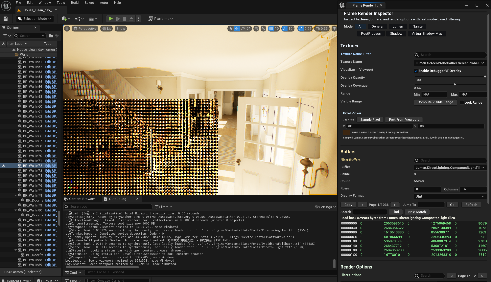

# Frame Render Inspector

[中文文档](docs/README_ZH.md)

## Overview

`Frame Render Inspector` is a lightweight Unreal Engine rendering debug plugin for inspecting frame textures, RDG buffers, and common render options directly inside the editor.

It is not intended to replace RenderDoc. The goal is to provide a faster day-to-day inspection tool that lets you quickly:

- browse frame textures
- inspect RDG / render buffers
- tweak common `r.*` render options
- visualize the selected texture in the editor viewport
- sample exact pixels from the preview

## Features

- Texture inspection
  - filter textures by name
  - select a texture and display it as a `DebuggerRT` viewport overlay
  - adjust `Overlay Opacity`
  - adjust `Overlay Coverage`
  - toggle `Visualize In Viewport`
  - compute and lock visible range

- Buffer inspection
  - enumerate RDG buffers from the current frame
  - inspect stride, count, and total byte size
  - display values as `Float / Int / UInt / Hex`
  - paginate, jump to address, search for values, and copy the current page

- Render options inspection
  - enumerate common `r.*` console variables
  - inspect and edit `bool / int / float` values directly
  - filter and paginate entries

- Pixel sampling
  - sample pixels from the current `DebuggerRT` preview
  - sample by manual pixel coordinates
  - sample by clicking inside the editor viewport
  - view linear color, LDR color, and sampling status

- Mode-based filtering
  - `All`
  - `General`
  - `Lumen`
  - `Nanite`
  - `PostProcess`
  - `Shadow`
  - `Virtual Shadow Map`

- Persistent state
  - inspector state is saved automatically
  - the previous session is restored by default

## Unreal Engine Version

- currently developed based on Unreal Engine 5.2
- this plugin requires a small engine source modification to expose Render Graph debug accessors
- other Unreal Engine 5.x versions may require minor adaptation
- some engine branches may require a small set of Render Graph debug accessors
- in this project, these accessors are used to inspect pooled and external RDG textures and buffers
- these additions are for debug inspection only and do not change normal rendering behavior
- compatibility with older engine versions is not guaranteed

## Engine Source Change

For the engine-side Render Graph debug accessors used by this plugin, see [docs/ENGINE_SOURCE_CHANGE.md](docs/ENGINE_SOURCE_CHANGE.md).

## Installation

1. Place the plugin under:

```text
<YourProject>/Plugins/FrameRenderInspector
```

2. Regenerate project files if needed, or open the project directly.
3. Build the project.
4. Launch the editor.

## Usage

1. Open the tool from:

```text
Tools -> Frame Render Inspector
```

2. Select a texture in the `Textures` section.
3. Enable or disable `Visualize In Viewport` depending on whether you want the overlay drawn in the viewport.
4. Adjust overlay parameters and inspect the result in the editor viewport.
5. Inspect RDG buffers in the `Buffers` section.
6. Edit common render variables in the `Render Options` section.
7. Sample pixels from the `Pixel Picker` panel.

## Screenshots



## Project Layout

The codebase is organized by feature area for readability and maintenance:

```text
Source/
  FrameRenderInspector/
    Collector/   -> capture, readback, viewport overlay
    Module/      -> lifecycle, settings, UI sync, actions
    UI/
      Common/    -> UI assembly
      Texture/   -> texture and overlay UI
      Buffer/    -> buffer inspection UI
      Options/   -> render options and mode filters

  FrameRenderInspectorPixelPicker/
    -> pixel sampling module
```

## Good Use Cases

- quickly verifying whether a debug texture is produced correctly
- inspecting single-channel textures, shadow maps, and intermediate Lumen / Nanite results
- checking RDG buffer layout and content
- temporarily changing render variables and observing the result
- validating exact pixel values directly inside the editor

## Notes

- This plugin is intended for editor-side debugging during development.
- The `Render Options` panel writes directly to live console variables.
- Texture and buffer visibility depends on the current frame and render path.
- Viewport overlay size depends on viewport size, valid content region, and overlay settings.

## Known Issues

- Some render resources only exist in specific passes or specific frames, so the visible list can change with scene and view state.
- RDG buffer visibility depends on the current render path and resource lifetime.
- Viewport overlay bounds are still constrained by viewport size and the valid content region.

## Roadmap

- add more mode presets and finer-grained filter rules
- continue improving viewport overlay behavior
- add richer RDG / render resource categorization
- keep refining UI and module boundaries as the tool grows

## License

This project is licensed under the MIT License. See [LICENSE](LICENSE) for details.
